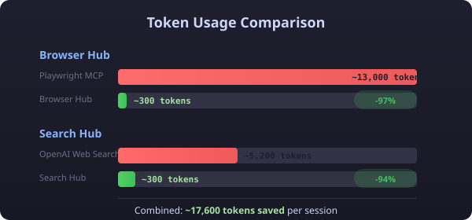
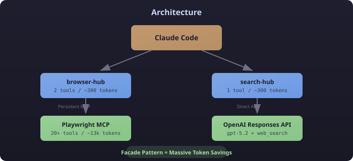

<p align="center">
  
</p>

<p align="center">
  <a href="#installation"></a>
  <a href="LICENSE"></a>
  <a href="#tools"></a>
</p>

---

MCP servers often expose every possible parameter, inflating tool schemas to **thousands of tokens**. These facades dramatically reduce context usage while maintaining full functionality.

<p align="center">
  
</p>

## Tools

| Hub | Purpose | Upstream | Savings |
|-----|---------|----------|---------|
| **[browser-hub](./browser-hub/)** | Browser automation | Playwright MCP | 13k → 300 tokens |
| **[search-hub](./search-hub/)** | Web research | OpenAI API | 5.2k → 300 tokens |

## Architecture

<p align="center">
  
</p>

## Installation

Each tool is a standalone Python package managed with [uv](https://github.com/astral-sh/uv):

```bash
# Browser automation
cd browser-hub && uv sync

# Web research
cd search-hub && uv sync
```

## Configuration

Add to `~/.claude.json`:

```json
{
  "mcpServers": {
    "browser-hub": {
      "type": "stdio",
      "command": "uv",
      "args": ["run", "--directory", "/path/to/mcp-tools/browser-hub", "browser-hub"]
    },
    "search-hub": {
      "type": "stdio",
      "command": "uv",
      "args": ["run", "--directory", "/path/to/mcp-tools/search-hub", "search-hub"],
      "env": {
        "OPENAI_API_KEY": "${OPENAI_API_KEY}"
      }
    }
  }
}
```

> **Tip:** Disable the Playwright plugin in `~/.claude/settings.json` to avoid duplicate tools.

## Quick Start

### Browser Automation

```python
# Navigate and interact
browser(action="navigate", url="https://example.com")
browser(action="snapshot")  # Returns element refs: E1, E2, E42...
browser(action="click", ref="E5", element="Login button")  # ref + element required
browser(action="type", ref="E6", element="Email", text="user@example.com")  # ref + element + text

# Batch operations for efficiency (note: omits images to keep responses small)
browser_batch(steps=[
    {"action": "navigate", "url": "https://example.com"},
    {"action": "snapshot"},
    {"action": "click", "ref": "E5", "element": "Submit"},
    {"action": "wait_for", "text": "Success"}
])
# Use browser(action="screenshot") separately if you need the actual image
```

### Web Research

```python
# Ask complete questions, not keywords
web_research(task="What are the latest developments in quantum computing?")

# Adjust reasoning depth
web_research(
    task="Compare React vs Vue for enterprise applications",
    reasoning_effort="high"
)
```

## Design Philosophy

```
┌─────────────────────────────────────────────────────────────┐
│  Traditional MCP: Every parameter exposed = token bloat    │
│                                                             │
│    timezone: TimeZoneName (500+ options)                   │
│    locale: string                                           │
│    coordinates: { lat: number, lng: number }               │
│    ...20 more optional params                              │
└─────────────────────────────────────────────────────────────┘
                           ↓
┌─────────────────────────────────────────────────────────────┐
│  MCP Tools: Minimal interface, sensible defaults           │
│                                                             │
│    web_research(task: string, effort?: "low"|"medium"|"high")  │
│                                                             │
│  That's it. Everything else handled internally.            │
└─────────────────────────────────────────────────────────────┘
```

## Requirements

| Dependency | Purpose |
|------------|---------|
| Python 3.11+ | Runtime |
| [uv](https://github.com/astral-sh/uv) | Package management |
| Node.js 18+ | Playwright MCP (browser-hub) |
| OpenAI API key | Web search (search-hub) |

## Contributing

PRs welcome! When adding a new hub:

1. Create `new-hub/` with the standard structure
2. Target **<500 tokens** for tool schemas
3. Use sensible defaults—don't expose optional params
4. Add to the table above

## License

MIT
